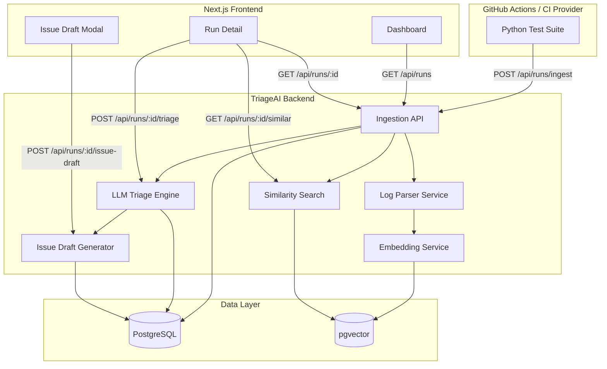

# TriageAI - AI-Powered CI Failure Triage Platform

## What is TriageAI?

TriageAI is an intelligent CI failure triage platform that automatically diagnoses CI/CD failures by:

1. **Ingesting CI run data** — capturing logs, metadata, and test results from your pipelines
2. **Parsing and structuring failure logs** — extracting stack traces, exception names, and error patterns
3. **Finding similar historical failures** — using vector embeddings to retrieve related past incidents
4. **AI-powered triage** — classifying root causes and generating actionable debugging steps
5. **Issue draft generation** — creating ready-to-file GitHub/Jira issues with context

## Architecture



## Prerequisites

- Docker & Docker Compose
- Python 3.11+
- Node.js 18+
- OpenAI API key (or compatible endpoint)

## Setup

### 1. Clone and configure

```bash
cp .env.example .env
# Edit .env and add your OPENAI_API_KEY
```

### 2. Start with Docker Compose

```bash
docker-compose up --build
```

This starts:
- **PostgreSQL** on port 5432 (with pgvector extension)
- **FastAPI backend** on port 8000
- **Next.js frontend** on port 3000

### 3. Verify health

```bash
curl http://localhost:8000/api/health
```

## Environment Variables

| Variable | Default | Description |
|----------|---------|-------------|
| `POSTGRES_USER` | `buildlens` | PostgreSQL username |
| `POSTGRES_PASSWORD` | `buildlens_dev` | PostgreSQL password |
| `POSTGRES_DB` | `buildlens` | Database name |
| `DATABASE_URL` | *(set in compose)* | Async DB connection string |
| `OPENAI_API_KEY` | — | **Required.** Your OpenAI API key |
| `OPENAI_API_BASE` | `https://api.openai.com/v1` | LLM endpoint |
| `LLM_MODEL` | `gpt-4o-mini` | Chat model for triage |
| `EMBEDDING_MODEL` | `text-embedding-3-small` | Embedding model |
| `EMBEDDING_DIMENSIONS` | `1536` | Embedding vector size |

## API Endpoints

| Method | Endpoint | Description |
|--------|----------|-------------|
| `GET` | `/api/health` | Health check |
| `POST` | `/api/runs/ingest` | Ingest a CI run |
| `GET` | `/api/runs` | List all CI runs (paginated) |
| `GET` | `/api/runs/{id}` | Get a single CI run |
| `POST` | `/api/runs/{id}/triage` | Run TriageAI analysis on a failure |
| `GET` | `/api/runs/{id}/similar` | Find similar past failures |
| `POST` | `/api/runs/{id}/issue-draft` | Generate an issue draft |

### Example: Ingest a CI run

```bash
curl -X POST http://localhost:8000/api/runs/ingest \
  -H "Content-Type: application/json" \
  -d '{
    "repo_name": "acme/my-service",
    "branch": "main",
    "commit_sha": "a3f8c2d",
    "pipeline_id": "12345",
    "environment": "production",
    "status": "failed",
    "test_suite_name": "integration",
    "failed_test_names": ["test_payment_flow", "test_checkout_timeout"],
    "raw_log_text": "FAILED tests/test_payment.py::test_payment_flow\nError: AssertionError: expected 200 got 500\n...",
    "timestamp": "2025-01-15T14:32:00Z"
  }'
```

## Running Tests

```bash
# Backend tests
cd backend
pip install -r requirements.txt
pytest tests/ -v

# Frontend tests
cd frontend
npm install
npm test
```

## Triggering the Demo CI Workflow

The example project in `examples/python-sample/` includes a GitHub Actions workflow that runs tests and sends results to TriageAI.

```bash
cd examples/python-sample
# View the workflow at .github/workflows/triageai-workflow.yml
```

### Local Demo Script

Alternatively, run the demo ingestion script locally with your backend running:

```bash
cd backend
# Make sure PostgreSQL and backend are running first
python -m scripts.demo_ingest
```

## Screenshots

> _Dashboard showing recent CI runs with status, repo, branch, and AI summary_
> ![Dashboard Placeholder]

> _Run detail page with triage results and similar failures_
> ![Run Detail Placeholder]


## Future Improvements

- [ ] Background job queue (Celery/Redis) for async triage processing
- [ ] Real GitHub Issues / Jira API integration for automatic issue filing
- [ ] Webhook support for GitHub Actions, Jenkins, GitLab CI
- [ ] Team/owner assignment based on CODEOWNERS file analysis
- [ ] Failure trend analytics dashboard (pass rate over time, flaky test detection)
- [ ] Slack/Teams notifications for triaged failures
- [ ] Multi-repo support with per-repo triage history
- [ ] Self-hosted embedding models (Ollama) for privacy-sensitive environments
- [ ] OpenTelemetry instrumentation for observability